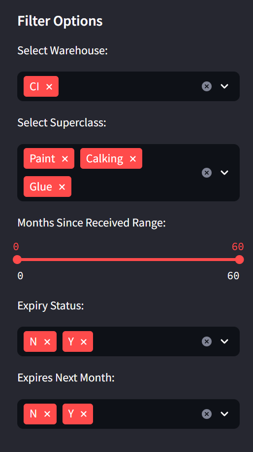
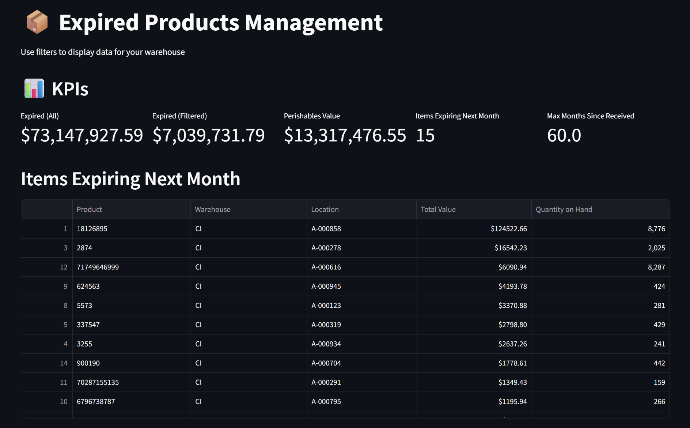
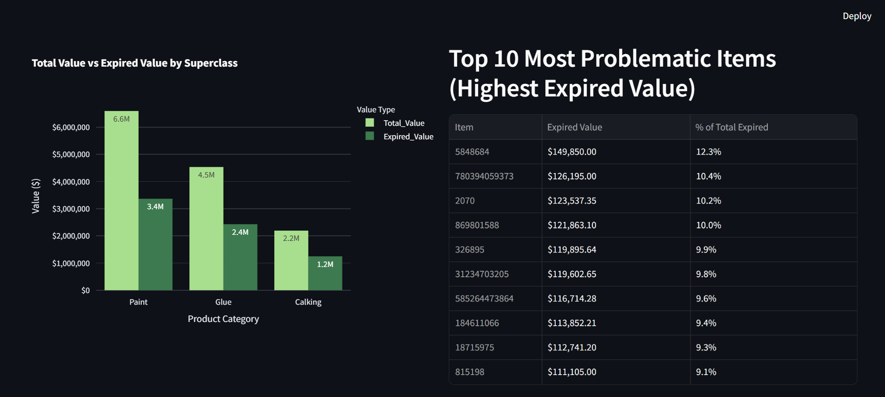
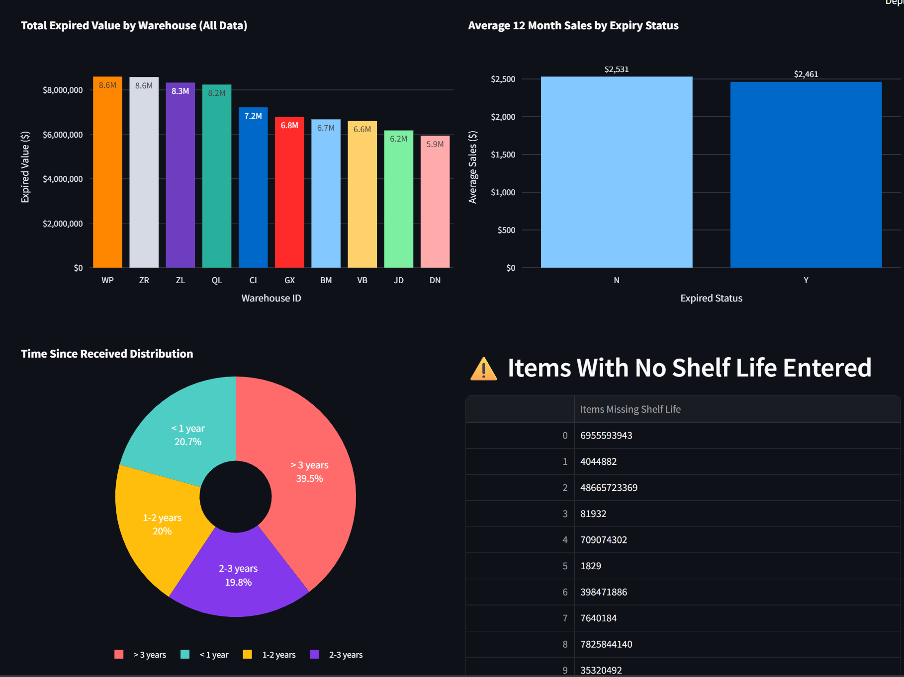
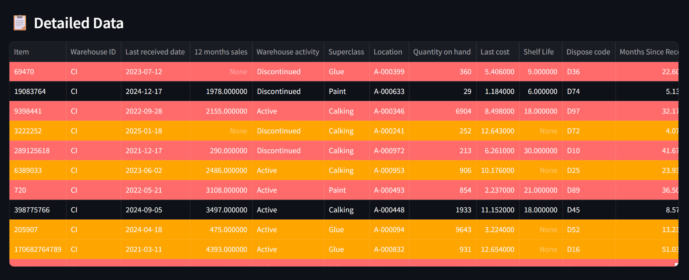

# Expired Products Management

## I. Project Objective

The goal of this project is to produce a dashboard that can be easily used by warehouse managers to keep track of expired products.
This will decrease losses as it will initially reduce customer returns related to expired products. In addition, this will help company CEOs keep track of the actual sellable inventory value in each warehouse (by removing the value of expired goods).
  
## II. Data Description

Due to policy issues, I cannot use real company data. However, the fictional dataset used was created to imitate the real situation and contains real world variables.

- Item number: Each number has a unique identifier that is composed of numbers
- Warehouse ID: Each warehouse has a unique 2-letter identifier.
- Last received date: date at which the warehouse received the last shipment of that item. The format will be YYMMDD
- 12 months sales: units sold in the last 12 months
- Warehouse activity: Active or Discontinued
- Superclass: Only superclasses Calking, Glue and Paint
- Location: Location where the item is stocked in the corresponding warehouse. The format will be A-000XXX
- Quantity on hand: Quantity available for sale for the specified item
- Last cost: Unit cost from the last batch received
- Shelf Life: How long an item lasts in stock until it expires
- Dispose code: Each item has a suitable way for being discarded.

## III. Methodology

The first step in this project is creating the dataset containing the initial variables using a Python code. Then calculations and more input is made to create new variables related to the existing ones (sums, tags, etc.). Then, deployment is done through using Streamlit on VSCode. The created dashboard allows, through filters, to visualize the findings.

## IV. Dashboard

The dashboard contains 5 filters where all data is selected by default and the user must remove what options untill they get what they need.
In the below image, the warehouse CI is chosen.

At the top of the page, there is some major KPIs. "Expired (All)" is the value of all expired products in inventory. This figure remains unchanged at all time unless the main data changed. All the other KPIs are related to the filtered data. Right below, there is a list of the items expiring next month at the filtered warehouse(s).

The following graphs and table are all related to the filtered data except for "Total Expired Value by Warehouse (All Data)" which displays the value per warehouse.

